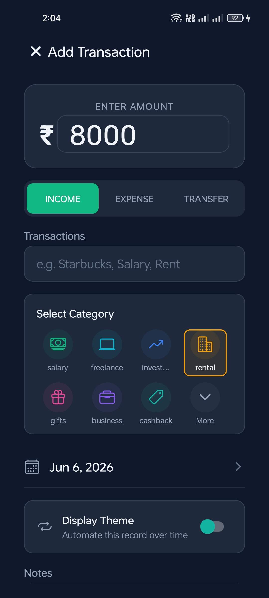
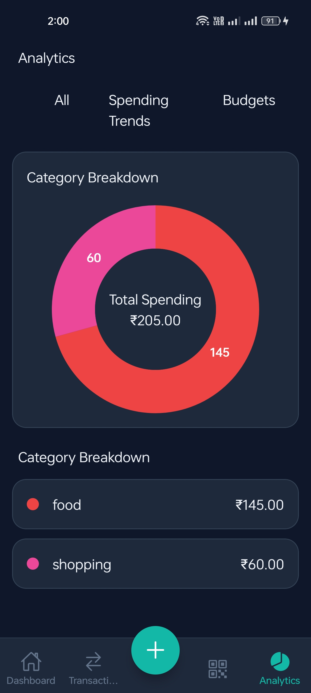
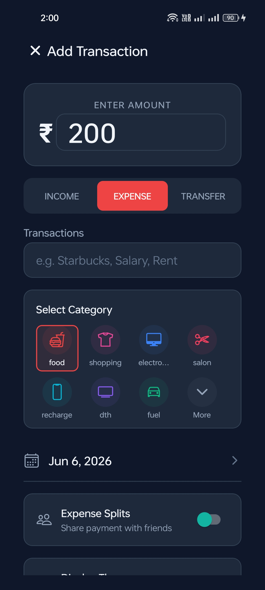
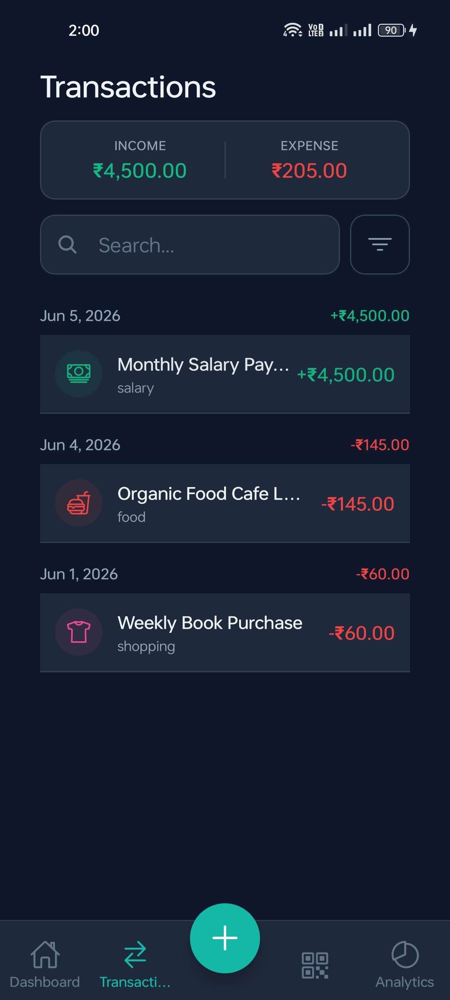
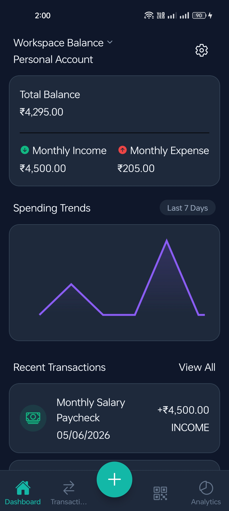
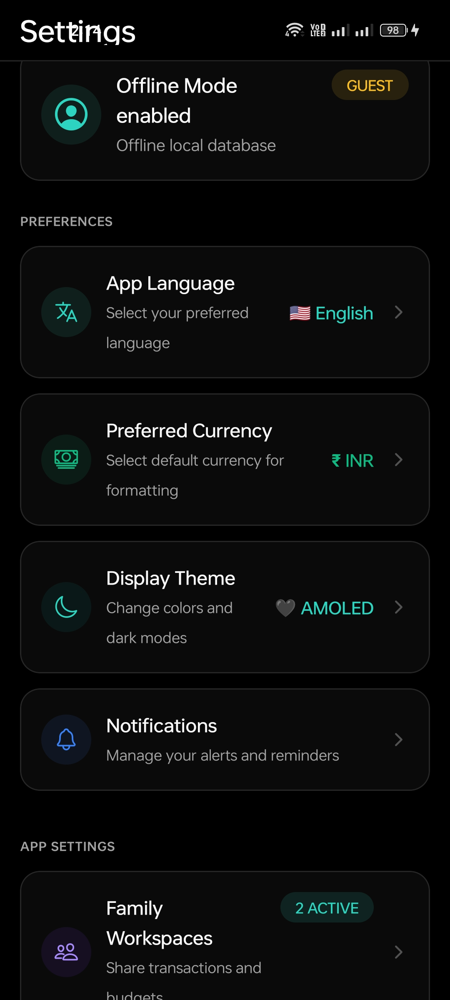

# Paisa Track 🛡️💸

Paisa Track is a premium, privacy-first expense tracking application built with React Native and Expo. It is designed to give you absolute control over your finances locally, securely, and seamlessly.

## ✨ Key Features

- **📷 Built-in UPI QR Scanner**: Instantly scan any UPI QR code. Paisa Track parses the payee details and automatically links them to your new transaction—no more manual data entry for digital payments!
- **🔒 Absolute Privacy & App Lock**: Your financial data never leaves your device. Everything is stored locally using high-performance encrypted storage (`react-native-mmkv`). Secure your app with built-in Fingerprint/Face ID biometric locking.
- **⚡ Blazing Fast & Easy to Use**: Built with Reanimated and Zustand, the app boasts buttery smooth 60fps animations and a deeply intuitive user interface designed for one-handed rapid entry.
- **📊 Smart Categorization**: Tag, organize, and filter your income, expenses, and transfers with dynamic categories.
- **🌙 Beautiful UI/UX**: Carefully crafted with TailwindCSS (NativeWind), featuring dynamic layouts, crisp typography, and fluid transitions.

## 📱 Screenshots

<p align="center">
  
  
  
  
</p>

<p align="center">
  
  
  
  
</p>

## 🚀 Tech Stack

- **Framework**: React Native & Expo (SDK 52+)
- **Styling**: NativeWind (TailwindCSS)
- **State Management**: Zustand
- **Storage**: React Native MMKV & Expo Secure Store
- **Animations**: React Native Reanimated
- **Security**: Expo Local Authentication

## 📦 Building for Production (Android)

To generate an installable APK for your device using Expo Application Services (EAS):

```bash
# 1. Install the EAS CLI globally
npm install -g eas-cli

# 2. Login to your Expo account
eas login

# 3. Trigger the cloud build
eas build --platform android --profile production-apk
```

## 🛠️ Local Development

1. Install dependencies:
   ```bash
   npm install
   ```
2. Start the development server:
   ```bash
   npm run dev
   ```
3. Scan the QR code with the Expo Go app on your phone, or press `a` to launch in an Android Emulator.

## 🧪 Testing

The app includes a fully configured Jest testing suite with mock configurations for native modules (like MMKV and Worklets).

```bash
npm run test
```
